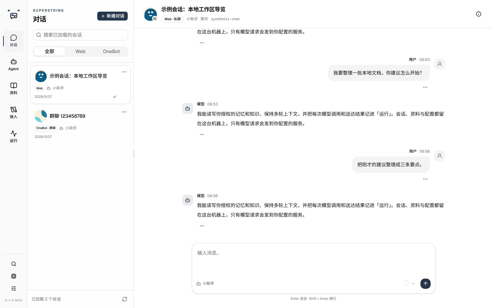
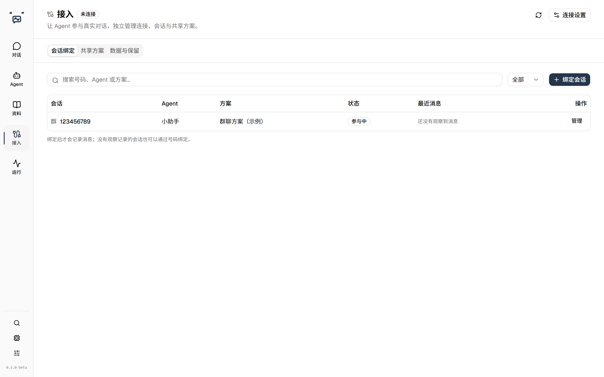
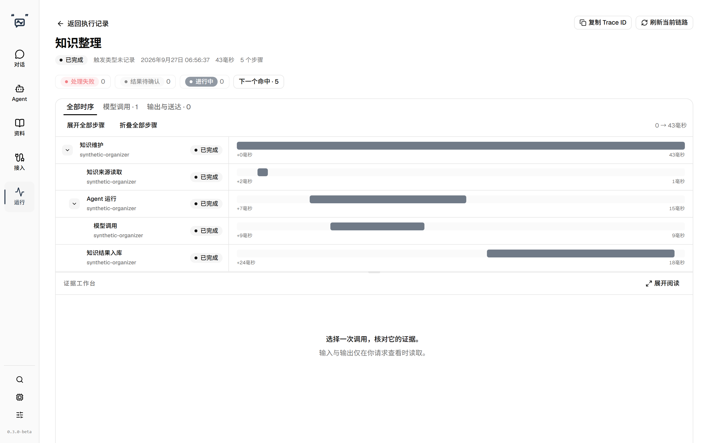

<p align="center">
  
  <br>
  
</p>

# Superstring

A local Agent workspace for web conversations, QQ groups and private chats, memory, and knowledge.

**Version:** `0.3.0-beta` — prerelease.

[English](#english) · [简体中文](#简体中文)

## English

### Conversations, with context

Keep web conversations and connected QQ conversations in one workspace. Choose an Agent, give it an identity and model, and let it use the memories and documents you authorize. Conversation history, settings and imported materials are stored locally; requests sent to an external model provider include the context needed for that request.

Superstring does not bundle model weights or a QQ client, create a cloud account, or synchronize your data to a Superstring cloud service.



### QQ groups and private chats

Connect a separately running OneBot 11 WebSocket service, such as NapCat, then bind a group or private chat to an Agent and a named chat scheme.



New messages appear in a bound conversation as they arrive. The workspace listens for a metadata-only notification and refreshes the visible list and the open conversation from the application itself, so an arriving QQ message shows up without a manual refresh while already loaded content and your scroll position stay where they are. Message text is never broadcast; only the fact that something arrived is.

- Control direct responses, follow-up conversation, spontaneous participation and idle-topic initiation independently. A direct response triggers the Agent without an interest-score requirement; the Agent may still choose silence.
- Set the initiative threshold, quiet periods, cooldown, active hours and reply grouping. The application controls recipients and mentions; a model cannot invent a destination.
- Edit the scheme's scene, judgement, reply, review, sticker, media and compression prompts. Shared schemes can serve several bindings without sharing their conversation histories.
- Configure separate judgement and reply windows. Older messages outside the reply window accumulate before compression into bounded context packages; judgement does not consume those packages.
- A QQ wake-up is no longer refused as over budget when the material it actually assembles fits: the available reference material is now measured against the messages that survived selection, instead of the wider set before it. A conversation that genuinely does not fit is still rejected with the same clear reason.
- Pause a binding while continuing to observe incoming messages. Inspect why an attempt stayed silent, failed or did not reach confirmed delivery.
- Give a bound group a display name of your own. A custom name is shown when set, otherwise the group's own QQ name, and otherwise the group number. The group number stays visible on the conversation card, in the conversation header and in its details, so a renamed group is still identifiable.

Each bound group can also be enabled or disabled from its conversation card and from the open group conversation. A disabled group keeps receiving and storing messages, but the Agent stays silent and starts no new model work; summaries and memory organisation already running finish under the existing pause boundary. The controls show why a group cannot speak, such as the global QQ switch being off, a disconnected transport or a disabled Agent.

**Group settings** opens a full settings page for one QQ account, group and Agent. Participation, response, context, media and prompt fields either follow the shared scheme or carry a group-only value; fields left on follow pick up later scheme updates, and saved values stay with that group and Agent, so rebinding does not inherit them and switching back restores them. System capabilities can only be set to "disabled in this group", which immediately constrains later calls and pending results; the page never grants access, and sticker choices can only narrow the collections the base scheme already authorises. Changing the base scheme previews the new base values and asks whether to keep the group values or follow the scheme — capability changes are not reset, and application-level settings such as data retention and model choice are not overridden here. Drafts, save/discard/cancel and conflict handling match scheme editing.

QQ access has its own prerequisites:

1. Install a QQ NT client and log in once. Take the supported QQ version from your OneBot implementation's own release notes ([NapCat releases](https://github.com/NapNeko/NapCatQQ/releases)); the combination validated here is NapCat v4.18.28 with QQ 9.9.26.44343.
2. Install an OneBot 11 implementation such as [NapCat](https://github.com/NapNeko/NapCatQQ). On Windows its Shell package bundles its own Node.js runtime: unzip it and start `launcher.bat` (`launcher-win10.bat` on Windows 10). The console prints a WebUI address and a one-time password — use them to open the panel.
3. In that panel, enable a forward WebSocket server and note its address, port and access token. Keep the endpoint and the token private; a connected transport is not a guarantee of delivery.
4. In Superstring, open **Schemes**, open the QQ application and select **Connection**, then enter that address, port and token. Create a chat scheme and bind the group or private chat to an Agent and the scheme; binding and usage views are part of the scheme details. Enable only the triggers you want; a direct response bypasses interest scoring but the Agent may still choose silence. See that implementation's own installation guide for the current packages and steps.

QQ automation can be affected by platform rules and account restrictions. Superstring does not log into QQ for you. Use an account suitable for testing and keep the OneBot endpoint and access token private.

### Memory, knowledge and media

- Manage long-term memories by Agent and source partition, inspect their sources, and correct or block inaccurate content. QQ memory is isolated by conversation and binding; sharing with your own private chat requires explicit configuration. If a store already uses full-read retrieval, its two full-read parameters stay editable on the same page; ordinary configurations do not add a full-read option.
- Import UTF-8 text or Markdown into the knowledge library, organize documents into categories, and grant access per Agent. Imported documents are not automatically authorized.
- Select local or registered OpenAI-compatible models for conversation, judgement, vision, memory and organization tasks. External providers have their own endpoint, credential and declared context window.
- Describe supported images and sampled animated-image frames with a configured vision model. Import sticker assets, edit their descriptions and tags, review and enable them, then authorize collections for chat schemes.
- Send text, a sticker, or both. Delivery records distinguish confirmed, partial and unknown outcomes; unknown delivery is not blindly sent again.

Voice transcription, full-video understanding, image generation and arbitrary executable tools are not available in this version.

### Workspace and diagnostics

The navigation is organized as **Conversations**, **Agents**, **System capabilities**, **Schemes**, **Library** and **Extensions**, with **Model services** and **Preferences** as separate entrances.

The application warms the data behind its main spaces while it starts, so opening Agents, the knowledge library, memories or Extensions usually shows content straight away instead of an empty first load; the Model services page reuses provider data fetched during startup for its first render, and its existing foreground refresh and connection checks remain. Scheme configuration pages skip needless redraws when unrelated state changes, and memory and summary reading perform fewer duplicate internal queries. A space you leave open for a moment updates quietly in the background rather than blocking you, and any draft you are editing is kept as you typed it. Customize conversation avatars, inspect context usage beside the composer, and browse execution waterfalls with model inputs and outputs when their sources remain authorized.

**Extensions** shows one Tools page listing every registered tool — the built-in system tools and any MCP tools — with its origin, read/write effect, global state and authorisation, and the Skills page lists both your installed skill documents and the guidance bundled with the application. Built-in components are shipped with the application and cannot be deleted or redefined; they grey out only when their global switch is off, never because one assistant lacks a grant. Tools that share a single authorisation resource edit that one grant. System capability pages keep their own functional settings and link to the concrete components they use.



English and Simplified Chinese, 16 themes, light/dark/system appearance, keyboard navigation and narrow layouts are supported. The original Superstring logo follows the selected theme throughout the workspace.

### Requirements and installation

Choose an asset for your operating system and architecture from [Releases](https://github.com/Verdspair/superstring/releases). `0.3.0-beta` is a prerelease; back up existing data before upgrading.

| Platform | Packages | Notes |
|---|---|---|
| Windows x64 | `superstring-setup-0.3.0-beta.exe` | Choose an installation folder; later installers upgrade the same folder |
| macOS 13+, Apple Silicon or Intel | Architecture-specific DMG and ZIP | Copy the application into Applications; replace it only after quitting. The prerelease macOS packages are ad-hoc signed and not notarized: open them with the Finder **Open** action |
| Linux glibc, x64 or arm64 | DEB and AppImage | DEB integrates with Debian/Ubuntu; AppImage needs a compatible desktop sandbox and FUSE setup |

Use the files actually attached to the chosen release and verify them with its checksum list. macOS signing status and platform-specific installation guidance are described in [Desktop distributions](docs/reference/desktop.md).

Packaged applications include their runtime. A local model server such as LM Studio, or a configured external OpenAI-compatible provider, is still required for inference.

1. Install and open Superstring.
2. Open **Model services** and configure your model service and default model roles. The local default endpoint is `http://127.0.0.1:1234/v1`.
3. Create or select an Agent. Import and authorize any knowledge it should read.
4. Start a web conversation.
5. To use QQ: install the QQ NT client and an OneBot 11 implementation such as NapCat, log into QQ, and start its forward WebSocket server — the validated versions, the Windows Shell package and the panel settings are listed under [QQ groups and private chats](#qq-groups-and-private-chats).
6. Open **Schemes**, open the QQ application and select **Connection**, enter that WebSocket address, port and access token, then bind the group or private chat to an Agent and a chat scheme.

If LM Studio requires an API token, provide `LM_STUDIO_API_KEY` before starting the application. Provider credentials configured through Model services are encrypted on disk; protect the profile and its encryption keys together.

### Data and upgrades

On Windows, conversations and settings live under the installation's `userdata` directory. Native macOS/Linux packages use the operating system's application-data profile. Closing a supported desktop window follows the **background / exit** preference; explicit Quit stops the owned local service.

Before upgrading, fully exit the application and back up the complete data directory. Do not open a migrated database with an older application. See [UPGRADING.md](UPGRADING.md) for the `v0.2.1 → v0.3.0-beta` changes, data paths and rollback procedure.

### Run from source

Install Node.js 22.12.0 or newer and the pinned dependencies:

```sh
npm ci
```

Start `start.cmd` on Windows or `./start.sh` on macOS/Linux. Both build the web assets and start the local service; Ctrl+C stops the source launch. For development, run `npm run dev:server` and `npm run dev:web` in separate terminals.

For source-only work, `ELECTRON_SKIP_BINARY_DOWNLOAD=1` skips the Electron runtime download during dependency installation. Native packaging uses the build instructions in [the desktop build README](tools/desktop/build/cross-platform/README.md).

### Documentation

- [Release notes](RELEASE_NOTES.md)
- [Upgrade guide](UPGRADING.md)
- [Desktop installation and recovery](docs/reference/desktop.md)
- [Runtime observability](docs/reference/runtime-observability.md)
- [Agent runtime](docs/architecture/agent-runtime.md) and [frontend workspaces](docs/architecture/frontend-workspaces.md)
- [MIT license](LICENSE); third-party license and NOTICE texts accompany packaged dependencies

---

## 简体中文

**版本：** `0.3.0-beta`，预发布版。

### 有上下文的对话工作区

在同一工作区管理网页对话、QQ 群聊和私聊。选择一个 Agent，配置身份与模型，再按需授权它读取记忆和文档。会话记录、配置和导入资料保存在本机；使用外部模型服务时，该次请求所需的上下文会发送给你配置的服务商。

Superstring 不内置模型权重或 QQ 客户端，不要求注册云端账号，也不把资料同步到 Superstring 云服务。


### QQ 群聊与私聊

连接独立运行的 OneBot 11 WebSocket 服务（例如 NapCat），再将群或私聊绑定到 Agent 和命名聊天方案。


新消息到达已绑定的会话时会直接显示出来。工作区只接收不含正文的消息通知，再由程序自行更新可见列表和正在看的会话，因此 QQ 新消息无需手动刷新即可出现，已加载的内容与滚动位置保持不动。通知里不含消息正文，只包含「有消息到达」这一事实。

- 独立控制直接回应、连续交谈、自主接话和冷场发起。直接回应不要求兴趣评分，但 Agent 仍可选择沉默。
- 设置主动开口门槛、安静时间、冷却、活跃时段与回复分组。收件人和提及由程序确定，模型不能自行指定任意目标。
- 编辑方案的场景、判断、回复、复核、表情、媒体与压缩提示词。多个绑定可复用方案，不会因此共享会话历史。
- 分别配置判断和回复窗口。回复窗口外的旧消息达到水位后压成有限数量的上下文包；判断档不读取这些包。
- QQ 唤醒时实际装配得下就不再被判为超预算：可用资料现在按筛选后真正保留的消息计算，而不是按筛选前的更大范围计算。确实装不下的会话仍会按同样明确的原因拒绝。
- 暂停绑定后继续观察新消息，并在执行记录里查看本轮为何沉默、失败或尚未确认送达。
- 可以给已绑定的群起一个自己的显示名。设了自定义名称就用它，否则用 QQ 原群名，都没有则显示群号。群号在会话卡片、会话顶部和详情里始终可见，改了名字也认得出是哪个群。

每个已绑定群还可以在会话卡片和打开的群会话顶部启用或停用。停用后群消息照常接收保存，但 Agent 不发言、不新增模型任务；已在运行的摘要与记忆整理按既有暂停边界完成。控件会如实显示群不能发言的原因，例如 QQ 总开关关闭、连接未就绪或 Agent 已停用。

**本群配置**为单个 QQ 账号 × 群 × Agent 打开完整设置页。参与、回应、上下文、媒体与提示词各项要么跟随共享方案（之后的基础方案更新继续生效）、要么保存为本群值；值归属于该群与该 Agent——改绑不继承，切回时恢复。系统能力只能设为「本群停用」，停用立即约束后续调用与未提交结果；本页不会授予访问，素材集合也只能收窄基础方案已授权的集合。更换基础方案会先预览新基础值，并询问保留本群值还是全部跟随——能力停用项不随之重置，数据保留、模型选择等应用级设置不在本页覆盖。草稿、保存/放弃/取消与冲突处理与方案编辑一致。

QQ 接入有自己的前置条件：

1. 安装 QQ NT 客户端并登录一次。支持的 QQ 版本以上游实现自己的版本说明为准（见 [NapCat Releases](https://github.com/NapNeko/NapCatQQ/releases)）；本版验证过的组合是 NapCat v4.18.28 ＋ QQ 9.9.26.44343。
2. 安装 OneBot 11 实现（例如 [NapCat](https://github.com/NapNeko/NapCatQQ)）。Windows 上其 Shell 包自带 Node.js 运行时：解压后运行 `launcher.bat`（Windows 10 用 `launcher-win10.bat`），控制台会打印面板（WebUI）地址与一次性密码，用它打开面板。
3. 在面板里开启**正向 WebSocket 服务端**，记下地址、端口与访问令牌；端点和令牌都要妥善保管，连接就绪不等于消息一定送达。
4. 回到 Superstring，在**方案**页打开 QQ 应用、进入**连接** Tab，填入该地址、端口与访问令牌；再新建聊天方案，把群或私聊绑定到 Agent 与方案，绑定与使用情况在方案详情中管理；只开启需要的触发，直接回应无需兴趣评分，但 Agent 仍可选择沉默。当前版本与安装步骤以该实现自己的安装文档为准。

QQ 自动化可能受到平台规则与账号限制影响。Superstring 不代登录 QQ；建议使用适合测试的账号，并妥善保管 OneBot 端点与访问凭据。

### 记忆、知识与媒体

- 按 Agent 和来源分区管理长期记忆，查看出处，纠正或屏蔽错误内容。QQ 记忆按会话与绑定隔离；与本人私聊共享需要显式配置。已使用全量读取的存量配置仍可在同一页面编辑两个全量读取参数；普通配置不会新增全量读取选项。
- 导入 UTF-8 文本或 Markdown 到知识库，分类管理并逐个授权 Agent；导入不等于授权。
- 为对话、判断、视觉、记忆和整理等用途选择本地模型或登记的 OpenAI 兼容模型。外部服务分别保存端点、凭据和声明的上下文容量。
- 使用已配置的视觉模型描述受支持的图片与动图抽帧。导入表情素材、编辑说明和标签，经检查启用后，将集合授权给聊天方案。
- 支持文字、表情或混合输出；送达记录区分已确认、部分完成与未知，不对未知送达盲目重发。

本版不提供语音转写、完整视频理解、AI 绘图或任意可执行工具。

### 工作区与诊断

导航按**对话、Agent、系统能力、方案、资料、扩展**组织，另设**模型服务**与**偏好**入口。

启动过程中会顺便预热主要工作区所需的数据，因此打开 Agent、知识库、记忆或扩展时通常直接看到内容，而不是先空一下再加载；模型服务页首屏复用启动时已取得的模型服务清单，并保留原有前台刷新与连接检查。方案配置页面在无关状态变化时避免多余重绘；记忆与摘要读取减少重复内部查询。页面停留一会儿会在后台安静更新，不会打断你；正在编辑的草稿按你输入的样子保留。可自定义会话头像、在输入框旁检查上下文用量，并通过执行瀑布查看来源仍有效且授权可读的模型输入与输出。

**扩展**中的「工具」页统一列出全部已注册工具——内置系统工具与 MCP 工具——逐项标注来源、读写、全局状态与授权；「技能」页同时列出你安装的技能文档与随应用提供的使用指南。内置组件随应用提供，不能删除或修改定义；只有全局开关关闭时才会灰显，不会因为某个助手缺少授权而变灰。共用同一授权资源的工具只编辑那一份授权。系统能力页保留各自的功能配置，并提供到具体所用组件的跳转。


支持简体中文与 English、16 种主题、浅色／深色／跟随系统、键盘导航及窄屏布局；原版 Superstring logo 在工作区内随主题配色。

### 运行要求与安装

从[版本页面](https://github.com/Verdspair/superstring/releases)选择对应系统与架构的文件。`0.3.0-beta` 是预发布版，升级前请先备份数据。

| 平台 | 安装形式 | 说明 |
|---|---|---|
| Windows x64 | `superstring-setup-0.3.0-beta.exe` | 可选安装目录，新版安装器覆盖同一目录升级 |
| macOS 13+，Apple Silicon／Intel | 对应架构的 DMG、ZIP | 将应用复制到 Applications，替换前完整退出；本预发布版的 macOS 包为临时签名、未公证，首次打开请用访达的「打开」放行 |
| Linux glibc，x64／arm64 | DEB、AppImage | Debian/Ubuntu 可使用 DEB；AppImage 需要兼容的桌面沙箱与 FUSE 环境 |

以所选版本实际附带的文件为准，并用同版校验清单核对。macOS 的签名状态与各平台安装方式见[桌面发行说明](docs/reference/desktop.md)。

安装包自带运行时，但模型推理仍需要 LM Studio 等本地服务或已配置的外部 OpenAI 兼容服务。

1. 安装并打开 Superstring。
2. 到**模型服务**配置服务端点与各用途默认模型；本地默认地址为 `http://127.0.0.1:1234/v1`。
3. 创建或选择 Agent，导入并授权所需知识。
4. 新建网页对话即可开始使用。
5. 要接入 QQ：安装 QQ NT 客户端与 OneBot 11 实现（例如 NapCat），登录 QQ，并开启其正向 WebSocket 服务端——已验证的版本组合、Windows Shell 包与面板设置见上文「QQ 群聊与私聊」。
6. 在**方案**页打开 QQ 应用、进入**连接** Tab，填入该 WebSocket 的地址、端口与访问令牌，再把群或私聊绑定到 Agent 与聊天方案。

LM Studio 开启鉴权时，启动前设置 `LM_STUDIO_API_KEY`。通过模型服务页保存的外部凭据以加密形式落盘，备份时应将资料目录与密钥一同保管。

### 数据与升级

Windows 的会话与配置位于安装目录的 `userdata`；原生 macOS/Linux 安装包使用系统应用数据目录。支持的桌面窗口关闭时遵循**后台运行／退出**偏好，明确退出应用会停止其管理的本地服务。

升级前完整退出并备份整个数据目录；不要用旧程序直接打开已经迁移的新库。`v0.2.1 → v0.3.0-beta` 的变化、数据位置与回退步骤见 [UPGRADING.md](UPGRADING.md)。

### 源码运行

安装 Node.js 22.12.0 或更高版本，再安装固定依赖：

```sh
npm ci
```

Windows 运行 `start.cmd`，macOS/Linux 运行 `./start.sh`；入口会构建前端并启动本地服务，Ctrl+C 停止。开发时可在两个终端分别运行 `npm run dev:server` 与 `npm run dev:web`。

仅做源码开发时，可在安装依赖前设置 `ELECTRON_SKIP_BINARY_DOWNLOAD=1` 跳过 Electron 运行文件下载。原生打包见[桌面构建 README](tools/desktop/build/cross-platform/README.md)。

### 文档

- [版本说明](RELEASE_NOTES.md)
- [升级指南](UPGRADING.md)
- [桌面安装与恢复](docs/reference/desktop.md)
- [运行观测](docs/reference/runtime-observability.md)
- [Agent 内核](docs/architecture/agent-runtime.md)与[前端工作区](docs/architecture/frontend-workspaces.md)
- [MIT 许可](LICENSE)；打包依赖附带各自的许可与 NOTICE 原文

---

## Thanks / 致谢

Thanks to [nkanf-dev](https://github.com/nkanf-dev) for refactoring and optimizing the front-end and back-end workflows and interface while preserving existing functionality, for his multi-platform support (macOS/Linux source launch and native desktop distributions), and for the early and ongoing discussions that shaped the project's direction — see the [pull request history](https://github.com/Verdspair/superstring/pulls).

感谢 [nkanf-dev](https://github.com/nkanf-dev)：在保留原有功能的前提下，重构并优化了前后端流程与界面，贡献了多平台支持（macOS/Linux 源码启动与原生桌面分发），并在项目早期及后续开发中共同讨论、确定了项目的发展方向（详见 [PR 记录](https://github.com/Verdspair/superstring/pulls)）。
