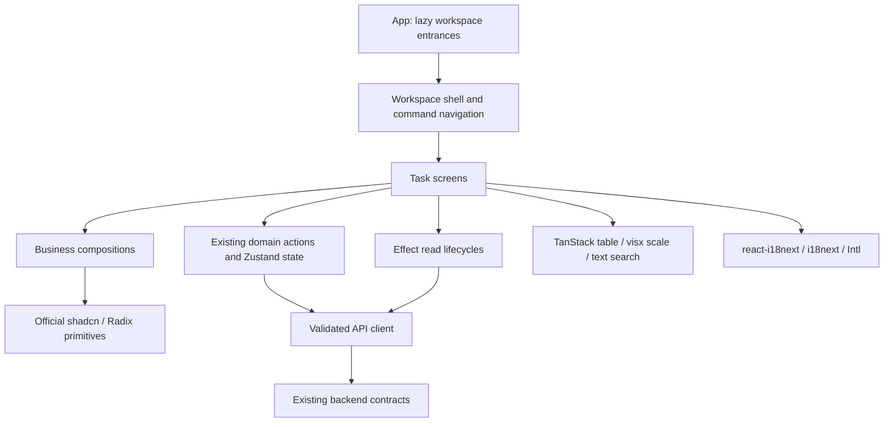

# Frontend workspaces

The frontend is organized around user tasks. The presentation layer is rebuilt in
`src/web/workspace` and `src/web/screens`; the former `app`, `ui`, and feature TSX
components are removed. Existing API contracts and domain state/actions remain the
source of truth for mutations, conversation identity, drafts, scopes and retries.

## Product structure

| Workspace | User tasks | Implementation |
| --- | --- | --- |
| Conversations | Web conversation, connected history, identity, context usage, source records, delivery and execution evidence | `screens/conversations` |
| Agents | Agent directory; identity and expression; models and context; memory and knowledge rules | `screens/assistants` |
| Library | Knowledge documents and organization; scoped memories and maintenance; sticker assets and collections | `screens/library` |
| Connections | Transport, observed and manually bound conversations, overrides, attention lists, shared schemes, retention | `screens/connections` |
| Runs | Filterable execution ledger, parent/child waterfall, model calls, protected input/output, attempts, delivery evidence | `screens/observability`, `screens/runs` |
| Model services | Provider credentials, declared models/capacities, health, shared purpose defaults | `screens/environment/ModelServices.tsx` |
| Preferences | Language, 16 themes, appearance mode, supported desktop behavior | `screens/environment/Preferences.tsx` |

Global navigation and command search go through the existing draft-aware navigation
actions. The selected configuration Agent, new-conversation candidate, and bound
conversation identity remain separate. Each screen owns its scrolling area; history
keeps its source anchor and explicit return-to-latest action.

## Dependency boundaries

- **Components and styling:** official shadcn/ui `radix-nova`, Radix, Tailwind CSS 4,
  Geist and Lucide. Add primitives with the registry CLI. There is no additional
  overlay, focus-trap, menu-positioning, table, or CSS component framework.
- **Complex views:** TanStack Table owns ledger columns/sorting/selection; visx
  owns time scaling; react-resizable-panels owns resizable inspection; literal
  content search uses highlight-words-core. Source relationships, permissions and
  event descriptions are application-specific projections of server facts.
- **Async reads:** small Effect fiber adapters isolate stale completions and own
  cancellation/poll lifetimes. They do not create a second mutation cache. Existing
  domain requests without an AbortSignal parameter still isolate stale results;
  this does not claim transport cancellation for every legacy API method.
- **Motion:** Motion owns entrance/layout transitions and follows reduced-motion
  preferences. Protected bodies are cleared immediately on scope/visibility loss;
  exit animations never retain sensitive evidence.
- **Brand:** the existing Logo geometry is retained. User themes map to standard
  semantic color tokens; the context indicator uses react-circular-progressbar.

## Functional boundaries

- Conversation source order, cursor paging, per-conversation drafts, retries using
  the original turn identity, quote/source links and uncertain sends are preserved.
- Agent page drafts and persona compilation still use domain actions. Manual model
  IDs remain possible when discovery is unavailable. Four-purpose default-model
  replacement requires an explicit confirmation for the selected Agent.
- Knowledge authorization, selected versus all modes, original versus generated
  drafts, versions and independent model/rule saves remain separate.
- Memory scopes, private-chat sharing, correction, governance, consolidation and
  filtered paging retain their existing semantics. Refresh loads maintenance data
  before the filtered page, so the shared request epoch cannot discard the former.
- Shared OneBot schemes retain trigger/rhythm/context/media/prompt controls, usage
  checks, whole-scheme saves, copying, and per-binding overrides. Program-defined
  reply instructions remain read-only. Credentials are write-only; clearing a
  credential remains an explicit operation.
- Execution evidence preserves explicit read permission, source expiry, actual
  requested/resolved model, attempts and unknown delivery status. Filters change
  the displayed evidence, not the running Agent.

## Conversation appearance

Product copy calls the configured identity **Agent** in both languages. User names,
stored prompt text, API fields and the model protocol's `assistant` role are not
rewritten.

Conversation avatars use the official shadcn Avatar/Dialog/RadioGroup components
and six CC0 DiceBear styles, generated locally without an external avatar service.
The conversation ID supplies a stable default; users can select another design,
upload a PNG/JPEG/WebP/GIF, or restore the default. The project Logo is separate.

Appearance is server-owned metadata on the canonical conversation history anchor.
Schema 44 stores a generated style/seed or the original image bytes in SQLite.
`PUT /v2/conversations/:id/avatar` saves or resets it; the conversation summary
includes the resulting metadata, and the corresponding GET serves uploaded bytes.
The normal conversation access check applies to both metadata and image requests.
Rebinding to another Agent isolates appearance; switching back restores that
Agent's conversation appearance. Deleting its source removes avatar data.

The directory's existing summary cache is the only frontend cache. A completed
write merges only the avatar field, invalidates stale directory reads, and stays
attached to its original conversation if the user navigates away. Other clients
receive the shared value when they load or refresh the directory. Concurrent
clients use last-successful-write semantics. Uploaded image URLs contain a content
revision; replaced revisions are not served. File recognition and dimensions use
`file-type` and `image-size`; accepted uploads are limited to 8 MiB, 8192 pixels per
dimension and 40 million pixels. Original GIF animation bytes are preserved.

## Internationalization

New UI uses `useTranslation()` or `<Trans>` directly with stable keys in standard
`i18n/locales/{zh-CN,en}/translation.json`. Dates, percentages and sizes use `Intl`
with the selected interface locale. Never translate user content.

The `notices` namespace preserves existing state-message keys and string feedback
contracts; interpolation is also owned by i18next. Language persistence and
cross-window synchronization remain in the existing preference boundary.

`npm run check:i18n` uses the official i18next CLI to check extracted-key drift,
hardcoded JSX text and interpolation parameters. Locale formatting belongs to that
CLI, rather than a competing formatter. Keep both catalogs complete when adding
business-selected dynamic keys; the locale completeness test covers both languages.

## Review and verification

Before submitting changes, check:

1. A mature component owns generic interaction; new application code expresses
   domain behavior rather than rebuilding a generic UI mechanism.
2. Errors remain visible inside the active modal, writes cannot be submitted twice,
   and failed operations preserve editable drafts.
3. Narrow-screen internal scroll regions remain usable with long output; checking
   document width alone does not catch content clipped inside a viewport.
4. `npm run typecheck`, `npm run test:web`, `npm run check:i18n`, `npm run check`,
   and `npm run build` pass for the changed surface.

Visual evidence should use synthetic data and accompany the review separately.
Do not put local preview servers, fixture scripts, screenshots or machine paths in
application commits. Real model/OneBot validation is a separate acceptance boundary.
