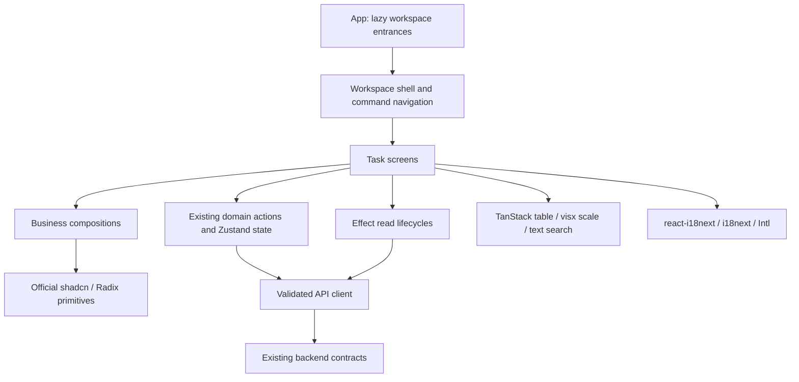

# Frontend workspaces

The frontend is organized around user tasks. The presentation layer is rebuilt in
`src/web/workspace` and `src/web/screens`; the former `app`, `ui`, and feature TSX
components are removed. Existing API contracts and domain state/actions remain the
source of truth for mutations, conversation identity, drafts, scopes and retries.

## Product structure

The six primary destinations are Conversations, Agents, System capabilities,
Schemes, Library and Extensions. Extensions uses the Puzzle icon; its internal
`SpaceId` remains `connections`. Model services and Preferences have separate
entrances. Execution remains available within Conversations rather than a separate
primary Runs destination.

| Workspace | User tasks | Implementation |
| --- | --- | --- |
| Conversations | Message records, runtime observability, tasks and approvals for every Web and QQ private/group conversation; current/global scope; identity, context usage, sources and delivery evidence | `screens/conversations`, shared `screens/observability` and `screens/runs` components |
| Agents | Agent directory; identity and expression; models and context | `screens/assistants` |
| System capabilities | Built-in capability directory; memory and knowledge reading rules; global knowledge reading budget; web access; media switches; execution switches and limits; runtime data retention | `screens/connections/CapabilitiesWorkspace.tsx` |
| Schemes | Application directory; QQ application tabs for Schemes, Connection, and Data and retention; scheme settings and conversations using each scheme; binding management | `screens/connections/SchemesWorkspace.tsx`, shared QQ panels and binding editor |
| Library | Knowledge documents and organization; scoped memories and maintenance; sticker assets and collections; description-only collection changes use the same source draft and save guard | `screens/library` |
| Extensions | External MCP, Skills and external tool grants only; no QQ connection status | `screens/connections`, internal `connections` space |
| Model services (separate) | Provider credentials, declared models/capacities, health, shared purpose defaults | `screens/environment/ModelServices.tsx` |
| Preferences (separate) | Language, 16 themes, appearance mode, supported desktop behavior | `screens/environment/Preferences.tsx` |

Global navigation and command search use the existing draft-aware navigation
actions. The selected configuration Agent, new-conversation candidate, and bound
conversation identity remain separate. Each screen owns its scrolling area;
history keeps its source anchor and explicit return-to-latest action.

### Conversation views

Every Web and QQ private/group conversation has Message records, Runtime
observability, and Tasks and approvals views. The scope selector distinguishes
`current` from `global`; global views remain accessible without a selected
conversation. Global observability includes maintenance spans that have no owning
conversation, as well as conversation executions. The execution ledger, parent/child
waterfall, model calls, attempts and protected input/output remain available.

Agent tool tasks and memory/knowledge maintenance jobs are distinct kinds of work,
not interchangeable task records. Execution completion, output submission and
confirmed delivery remain separate states. The legacy `execution-ledger` and
`task-ledger` destinations and `settingsView="observability"` resolve to the
corresponding global Conversation view instead of becoming invalid links.
The `screens/runs` and `screens/observability` directories remain shared components;
product navigation does not imply their removal.

### QQ application management and scheme details

The Schemes root (`scheme-library`) is organized by application. Only applications
with real scheme management appear; unsupported applications have no placeholders.
The QQ application heading opens its scheme list, with shortcuts to Connection and
Data and retention. Its three application tabs map to `qq-app-schemes`,
`qq-connection`, and the existing `qq-storage`, all within Schemes. The existing
`qq-scheme-config` destination stays in Schemes; legacy `operating-mode` resolves
to `qq-connection` rather than becoming invalid. The QQ breadcrumb in scheme details
returns to the application scheme list.

Connection contains the existing operating-mode controls, QQ global switch and
inline connection settings, without a duplicate configuration modal. Data and
retention covers all QQ schemes and conversations at application scope, not the
selected scheme. The retention window defaults to 14 days and is configurable from
1 to 3650; changes apply only to records written afterwards and never rewrite an
existing expiry stamp. Expired records become unreadable; physical cleanup is
manual-only and covers the five expiry categories (message bodies, media reading
notes, assistant speech, send records, nicknames). Rows in use or with unknown or
in-flight delivery are protected. Cleanup does not delete schemes, bindings or
sticker assets; message deduplication identity and memory-source identity are
retained. Runtime traces remain in Conversation views, not duplicated in QQ management.

QQ schemes remain shared between group and private conversations. Each scheme
detail has Scheme settings and Conversations using this scheme views. Settings
retains its four parameter tabs for participation, response, context, and media;
the usage count opens Conversations using this scheme directly.

Adding a conversation accepts an observed, unbound conversation or a manually
entered group/private number. It defaults to the current scheme and requires both
an Agent and a scheme. No unbind operation is exposed because the backend does not
provide one. The secondary `scheme-bindings` discovery entrance serves initial or
unbound setup and reuses the same editor; it is not a peer tab beside the scheme
directory or a second binding management system.

All entrances use the same draft source, ownership and save/discard/cancel guard.
Scheme drafts survive refresh; saving replaces the whole scheme under
compare-and-swap. Unknown usage is not zero and prevents deletion, as does known
active usage.

Every QQ group scheme card and open group conversation shows the group's enable/disable control and its Group settings entrance, both reading the same state. A disabled group keeps receiving and storing messages but produces no speech and starts no new model work; summaries and memory organisation already running may complete under the existing pause boundary. The group state never changes the global QQ switch, the Agent state or other groups, and blocking reasons are shown as they are.

Group settings is a full page scoped to one QQ account, group and Agent. Participation, response, context, media and prompt fields either follow the base scheme — including later base updates — or hold a group-only value; sticker collection selection can only narrow the collections the base scheme already authorizes, and application-level settings such as retention and model choice have no group override. System capabilities offer only follow-higher-layers or disabled-in-this-group; disabling takes effect immediately for later calls and pending results, while ordinary parameter changes apply to the next new round and a retry of an existing turn reuses its frozen snapshot under the current disable and source checks. Choosing a different base scheme previews the change and requires an explicit keep-or-reset decision, with capability disables not reset. Saved overrides belong to the binding × Agent pair: rebinding does not inherit them and switching back restores them. Saves replace the whole group record under compare-and-swap across the binding, the current Agent, the target base scheme and the group configuration; drafts survive refresh and conflicts, and discard or cancel leaves stored values untouched.

### Extensions and layout

Extensions contains only external MCP, Skills and External tool grants. It does not
contain QQ connection/data management or display QQ connection status. The display
name and Puzzle icon do not rename the internal `connections` space or component
directories, or change their business behavior.

Management views use the full available width with `px-4` (16px horizontal padding)
and the existing tokens, themes, style and components. Message and composer widths
stay unchanged. Panels, refresh mechanisms and runtime trace views are reused,
not duplicated. Repeated large headings, duplicate shells, nested collapses and
duplicate refresh controls within one view are removed; different views retain
their own real refresh operations. Navigation and layout do not change backend
contracts, defaults or permissions.

### 产品入口与 QQ 应用管理

六组产品入口为对话 / Agent / 系统能力 / 方案 / 资料 / 扩展；扩展英文名
Extensions，使用 Puzzle 图标，内部 `SpaceId` 的 `connections` 及组件目录不改。
模型服务与偏好独立。方案根目录 `scheme-library` 按应用组织，只显示真实支持的
应用，不为其他 App 创建占位；QQ 应用标题进入应用方案列表，并提供连接与数据快捷入口。
QQ 应用三 Tab「方案 / 连接 / 数据与保留」分别对应 `qq-app-schemes`、
`qq-connection`、原 `qq-storage`，均归方案；`qq-scheme-config` 仍归方案，旧
`operating-mode` 规范到 `qq-connection`。方案详情的 QQ 面包屑返回应用方案列表。

连接页保留运行模式控制、QQ 总开关及 inline 配置，不重复弹窗；数据与保留覆盖应用级
全部 QQ 方案与会话，不随当前方案筛选。保留天数默认 14 天、可配置 1–3650，只对之后
写入的记录生效，不回溯改写已有到期；到期即不可读，物理清理仅手动确认、覆盖五类到期
数据（消息正文、媒体阅读记录、助手发言、发送台账、昵称）。在用行与投递未知或进行中
的行受保护；不删除方案、绑定或表情素材，消息去重身份与记忆来源身份保留。不重复
对话运行追踪视图。QQ 群/私聊共用方案，详情仍分
「方案设置 / 使用会话」，保留参与、回应、上下文、媒体四参数 Tab，usage 数量直达
使用会话；添加可选已观察未绑定会话或手工号码，默认当前方案，Agent 与 scheme 均必需，
不增加后端没有的解绑。次级 `scheme-bindings` 复用同一编辑器，不设平级绑定 Tab。
同源草稿、所有权、保存/放弃/取消、整案 CAS、刷新保稿与未知/使用中禁删不变。

每张 QQ 群方案卡片与打开的群会话顶部常显同源的「启用 / 停用」与「本群配置」入口。停用后本群消息照常接收保存，但不发言、不新增模型任务；已运行的摘要/记忆整理可按既有暂停边界完成。群启停不改变 QQ 总开关、Agent 状态与其他群，阻止原因如实展示。

「本群配置」是仅作用于单个 QQ 账号 × 群 × Agent 的完整设置页：参与、回应、上下文、媒体与提示词各项跟随基础方案（含之后的基础方案更新）或保存本群值；素材集合只能收窄基础方案已授权集合，数据保留、模型选择等应用级设置没有本群覆盖。系统能力只有「跟随上层 / 本群停用」，停用立即约束后续调用与未提交结果；普通参数下一新轮生效，重试沿用冻结快照并复验当前停用与来源。更换基础方案先预览、需显式选择保留或重置，能力停用不随换方案重置。差异按绑定 × Agent 保存，改绑不继承、切回恢复；整份保存在绑定、当前 Agent、目标基础方案与群配置的比较交换（CAS）下提交；草稿刷新保留、冲突保稿，放弃/取消不改已存值。

扩展仅含外置 MCP、Skills、外部工具授权，不含 QQ 连接/数据页，不显示 QQ 连接状态。
管理正文全宽、`px-4`（左右16px），沿用原 tokens、主题、风格与组件，消息与 composer
宽度不变；复用面板、刷新机制与运行追踪视图，各视图保留自己的真实刷新。
入口迁移不改变后端契约、默认值、权限或业务。

## Dependency boundaries

```mermaid
flowchart TD
  App[App: lazy workspace entrances] --> Shell[Workspace shell and command navigation]
  Shell --> Screens[Task screens]
  Screens --> Compositions[Business compositions]
  Compositions --> Registry[Official shadcn / Radix primitives]
  Screens --> Domain[Existing domain actions and Zustand state]
  Screens --> Reads[Effect read lifecycles]
  Domain --> API[Validated API client]
  Reads --> API
  API --> Contracts[Existing backend contracts]
  Screens --> Evidence[TanStack table / visx scale / text search]
  Screens --> Locale[react-i18next / i18next / Intl]
```

- **Components and styling:** official shadcn/ui `radix-nova`, Radix, Tailwind CSS 4,
  Geist and Lucide. Add primitives with the registry CLI. There is no additional
  overlay, focus-trap, menu-positioning, table, or CSS component framework.
- **Complex views:** TanStack Table owns ledger columns/sorting/selection; visx
  owns time scaling; react-resizable-panels owns resizable inspection; literal
  content search uses highlight-words-core. Source relationships, permissions and
  event descriptions are application-specific projections of server facts.
- **Async reads:** small Effect fiber adapters isolate stale completions and own
  cancellation/poll lifetimes. They do not create a second mutation cache. Existing
  domain requests without an AbortSignal parameter still isolate stale results;
  this does not claim transport cancellation for every legacy API method.
- **Motion:** Motion owns entrance/layout transitions and follows reduced-motion
  preferences. Protected bodies are cleared immediately on scope/visibility loss;
  exit animations never retain sensitive evidence.
- **Brand:** one SVG master in `src/shared/brand` retains the original quotation
  marks, conversation bubble, string and two nodes in the project's 24-unit
  composition.
  Web SVG references and the favicon use that asset directly; the desktop build
  renders it with resvg into its embedded icon sizes. No separate handwritten
  desktop vector parser or duplicate path geometry remains. User themes map to
  standard semantic color tokens; the context indicator uses react-circular-progressbar.

## Functional boundaries

- Conversation source order, cursor paging, per-conversation drafts, retries using
  the original turn identity, quote/source links and uncertain sends are preserved.
- Agent page drafts and persona compilation still use domain actions. Manual model
  IDs remain possible when discovery is unavailable. Four-purpose default-model
  replacement requires an explicit confirmation for the selected Agent.
- Knowledge authorization, selected versus all modes, original versus generated
  drafts, versions and independent model/rule saves remain separate. Server-side
  search stays paginated and keeps its case-insensitive substring matching.
- Memory scopes, private-chat sharing, correction, governance, consolidation and
  filtered paging retain their existing semantics. Refresh loads maintenance data
  before the filtered page, so the shared request epoch cannot discard the former.
  A failed maintenance job is retried only after an explicit confirmation carrying
  its cost and the original snapshot; the retry re-verifies sources, and a failed
  re-check refuses the retry without creating a new job automatically.
- Shared OneBot schemes retain trigger/rhythm/context/media/prompt controls, usage
  checks, whole-scheme saves, copying, and per-binding overrides. Program-defined
  reply instructions remain read-only. Credentials are write-only; clearing a
  credential remains an explicit operation.
- Execution evidence preserves explicit read permission, source expiry, actual
  requested/resolved model, attempts and unknown delivery status. Filters change
  the displayed evidence, not the running Agent.

## Conversation appearance

Product copy calls the configured identity **Agent** in both languages. User names,
stored prompt text, API fields and the model protocol's `assistant` role are not
rewritten.

Conversation avatars use the official shadcn Avatar/Dialog/RadioGroup components
and six CC0 DiceBear styles, generated locally without an external avatar service.
The conversation ID supplies a stable default; users can select another design,
upload a PNG/JPEG/WebP/GIF, or restore the default. The project Logo is separate.

Appearance is server-owned metadata on the canonical conversation history anchor.
Schema 44 stores a generated style/seed or the original image bytes in SQLite.
`PUT /v2/conversations/:id/avatar` saves or resets it; the conversation summary
includes the resulting metadata, and the corresponding GET serves uploaded bytes.
The normal conversation access check applies to both metadata and image requests.
Rebinding to another Agent isolates appearance; switching back restores that
Agent's conversation appearance. Deleting its source removes avatar data.

The directory's existing summary cache is the only frontend cache. A completed
write merges only the avatar field, invalidates stale directory reads, and stays
attached to its original conversation if the user navigates away. Other clients
receive the shared value when they load or refresh the directory. Concurrent
clients use last-successful-write semantics. Uploaded image URLs contain a content
revision; replaced revisions are not served. File recognition and dimensions use
`file-type` and `image-size`; accepted uploads are limited to 8 MiB, 8192 pixels per
dimension and 40 million pixels. Original GIF animation bytes are preserved.

## Internationalization

New UI uses `useTranslation()` or `<Trans>` directly with stable keys in standard
`i18n/locales/{zh-CN,en}/translation.json`. Dates, percentages and sizes use `Intl`
with the selected interface locale. Never translate user content.

The `notices` namespace preserves existing state-message keys and string feedback
contracts; interpolation is also owned by i18next. Language persistence and
cross-window synchronization remain in the existing preference boundary.

`npm run check:i18n` uses the official i18next CLI to check extracted-key drift,
hardcoded JSX text and interpolation parameters. Locale formatting belongs to that
CLI, rather than a competing formatter. Keep both catalogs complete when adding
business-selected dynamic keys; the locale completeness test covers both languages.

## Review and verification

Before submitting changes, check:

1. A mature component owns generic interaction; new application code expresses
   domain behavior rather than rebuilding a generic UI mechanism.
2. Errors remain visible inside the active modal, writes cannot be submitted twice,
   and failed operations preserve editable drafts.
3. Narrow-screen internal scroll regions remain usable with long output; checking
   document width alone does not catch content clipped inside a viewport.
4. `npm run typecheck`, `npm run test:web`, `npm run check:i18n`, `npm run check`,
   and `npm run build` pass for the changed surface.

Visual evidence should use synthetic data and accompany the review separately.
Do not put local preview servers, fixture scripts, screenshots or machine paths in
application commits. Real model/OneBot validation is a separate acceptance boundary.
