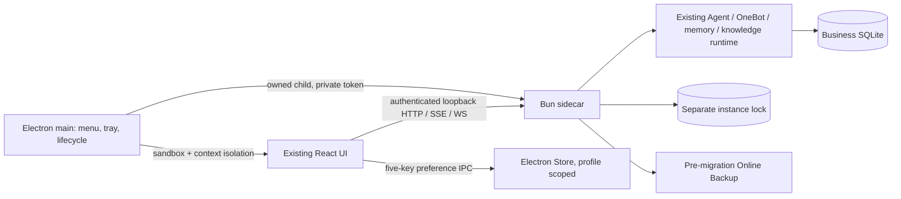

# Desktop distributions

## Supported targets

| Platform | Architecture | Package | Runtime validation |
| --- | --- | --- | --- |
| Windows | x64 | Existing `.exe` installer | Existing C# build and installer checks |
| macOS 13+ | Apple Silicon, Intel | Separate `.dmg` and `.zip` | Native runners, extracted app launch |
| Linux, glibc | x64, arm64 | Separate `.deb` and `.AppImage` | Ubuntu 24.04 native runners, installed DEB under Xvfb |

The application includes its JavaScript runtime. Node.js, Bun and Electron are not prerequisites for an end user. Model servers and model weights remain separate, as on Windows. The Linux AppImage payload is compared with the installed DEB in CI; that comparison does not certify FUSE integration on every distribution. A desktop session with Chromium sandbox support is required. Do not launch with `--no-sandbox` or as root.

macOS production artifacts must be Developer ID signed and notarized. Unsigned/ad-hoc PR artifacts are for validation and are not production releases. No release is published by opening a PR.

## Installation and updates

- macOS: open the matching DMG and copy **Superstring** into Applications. Quit the existing application before replacing it. The ZIP contains the same application bundle.
- Debian/Ubuntu: install the matching package using `sudo apt install ./superstring-<version>-linux-<arch>.deb`.
- AppImage: give the downloaded file executable permission, then open it in a supported desktop environment. AppImage/FUSE and sandbox requirements are distribution-specific; use the DEB on supported Debian/Ubuntu systems if those requirements are unavailable.
- The native Help menu opens the official releases page, application logs and data folder. Updates use the corresponding installer/package manager; there is no background self-updater in this release.
- Replacing or uninstalling the application does not erase the user profile. Remove that folder separately only when its conversations, memories, credentials and imported materials are no longer wanted.

Use the `SHA256SUMS` accompanying these new desktop assets to verify the downloaded bytes. The existing Windows-only distribution may also provide its legacy `SHA256SUMS.txt`.

## Data and recovery

| Mode | Default data root |
| --- | --- |
| macOS desktop | `~/Library/Application Support/Superstring` |
| Linux desktop | `$XDG_CONFIG_HOME/Superstring`, or `~/.config/Superstring` |
| Windows installer | Existing installation layout, unchanged |
| Source launch | Existing source/development layout, unchanged |

Within the new desktop profile:

```text
data/superstring.sqlite         conversations, Agents, memory, knowledge, telemetry
state/                         encryption keys, appearance and native preferences
config/                        feature configuration
qq/stickers/                   imported sticker material
chromium/                      isolated browser session storage
logs/desktop.log               rotated host and service log
backups/schema-<from>-to-<to>-*/ pre-migration recovery snapshots
maintenance/                   live service ownership lock
```

The installation's `resources/service/resources` directory is read-only application content. The new host never searches for or silently imports a source checkout's data. Language, appearance and encrypted selected Agent/session values persist across an automatic port change. Existing draft state and save behavior remain owned by the web application.

Before an existing database is migrated, the service holds an exclusive profile lock and uses SQLite Online Backup to snapshot committed data, including WAL contents. It copies associated `state`, `config` and `qq` files. `backup.json` marks a completed, flushed snapshot. A directory without that marker is incomplete. Current-schema startups do not create another snapshot; backups are not automatically pruned.

For rollback: fully quit the application and confirm the sidecar has stopped; preserve the current profile as a separate recovery copy; restore `data`, `state`, `config` and `qq` from one completed snapshot; then run the matching older application. Do not point an old executable at a newer database or mix encryption keys from another snapshot. Native browser cache and telemetry log files are not a substitute for a database backup.

## Window and process behavior

The existing **background / exit** preference controls the window close action. In background mode the page is destroyed while the service continues Agent, OneBot and maintenance work; reopen using the tray, macOS Dock or application launcher. Desktops without a tray can reopen the same instance from the launcher. Explicit **Quit Superstring** always requests service shutdown and waits for database work to settle.

The host does not forcibly kill an active database writer on a timer. A long shutdown presents a native status dialog and access to logs. If the host crashes, pipe EOF tells its own sidecar to shut down. A separate SQLite lifetime lock prevents a replacement host from opening the same profile concurrently while that shutdown finishes. Unexpected process/window failure offers retry, logs and quit; retry waits for the old service to exit.

## Implementation map



- `src/desktop/main.ts`: native application lifecycle and OS integration.
- `src/desktop/backend.ts`: child ownership, readiness identity and graceful stop.
- `src/desktop/security.ts`: session ownership and exact-origin credential injection.
- `src/desktop/preferences.ts`, `preload.ts`: narrow, sender-validated preferences bridge. No backend token or generic filesystem/IPC access is exposed to renderer code.
- `src/server/desktop-entry.ts`, `desktop-bootstrap.ts`: explicit packaged resource/profile startup.
- `src/server/desktop-access.ts`: all managed HTTP and WebSocket routes require authentication; legacy Windows and source launch retain their existing contracts.
- `src/server/desktop-service-lease.ts`, `desktop-backup.ts`, `desktop-parent.ts`: persistence and process lifecycle.
- `tools/desktop/build/cross-platform`: native packaging, signing, smoke checks, notices and artifact assembly.

## Build and release

Desktop CI uses Node 24 and the project-pinned Bun. Four native runners build macOS/Linux packages; a separate Windows lane exercises the existing C# installer pipeline. Avoid cross-compiling a package and treating that as a successful native launch.

For a development package on a matching host:

```sh
npm ci
npm run build:desktop:cross-platform -- --platform=darwin --arch=arm64
# Linux example: --platform=linux --arch=x64
```

Build tools create artifacts only under `artifacts/desktop` and `dist/desktop-*`; they do not inspect an installed user profile. `--dir` produces an unpacked validation app. Package builds download Electron and packaging tools; use CI when local space is limited.

The `Desktop packages` workflow accepts an **existing** version tag and an explicit release flag. The tag must match `package.json`. Release builds require macOS certificate/notarization secrets (`MACOS_CERTIFICATE`, `MACOS_CERTIFICATE_PASSWORD`, `APPLE_API_KEY_BASE64`, `APPLE_API_KEY_ID`, `APPLE_API_ISSUER`). Missing credentials fail; they never downgrade a release to unsigned output. Configure the `desktop-release` environment protection for the final draft-release job. All native package jobs, smoke reports and complete asset/hash checks must pass first.

The smoke runs a real packaged renderer and sidecar with a disposable profile, checks real business APIs and the lifetime connection, rejects unauthenticated access, and waits for graceful exit. It does not log into QQ, send messages, run a model, or validate signing credentials that have not been supplied. Release validation additionally verifies macOS signatures, Gatekeeper assessment and the notarization staple.

## 简要使用说明

macOS 提供 Apple Silicon / Intel 的 DMG、ZIP；Linux 提供 x64 / arm64 的 DEB、AppImage。Windows 保留原安装器。安装包自带运行时，模型服务仍需单独配置。关闭窗口遵循已有的“后台运行／退出”设置；菜单中的“退出 Superstring”会等待服务安全关闭。帮助菜单可打开日志、数据目录和更新页面。

数据保存在系统用户目录，升级或删除应用不会自动删除数据。只有需要数据库迁移时才生成备份，`backup.json` 是备份完整标记。正式 macOS 发布必须签名并公证；PR 验证产物不能当作正式发行。各平台构建与真实安装包冒烟由 CI 执行，源码测试通过不等于已完成签名或所有桌面环境验证。
